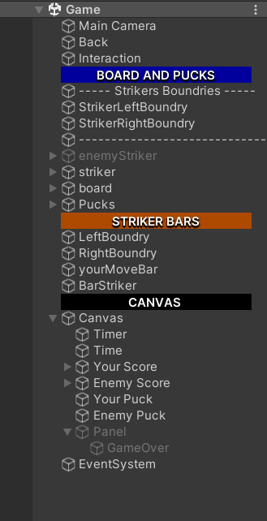
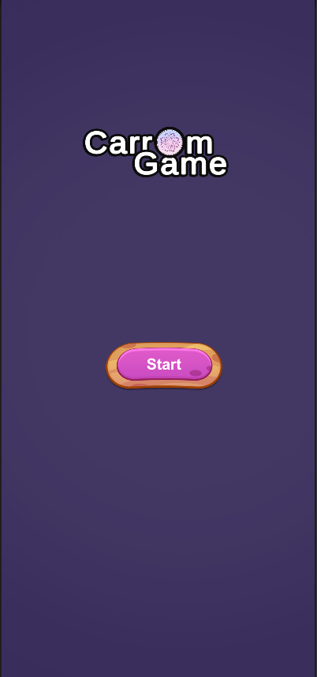
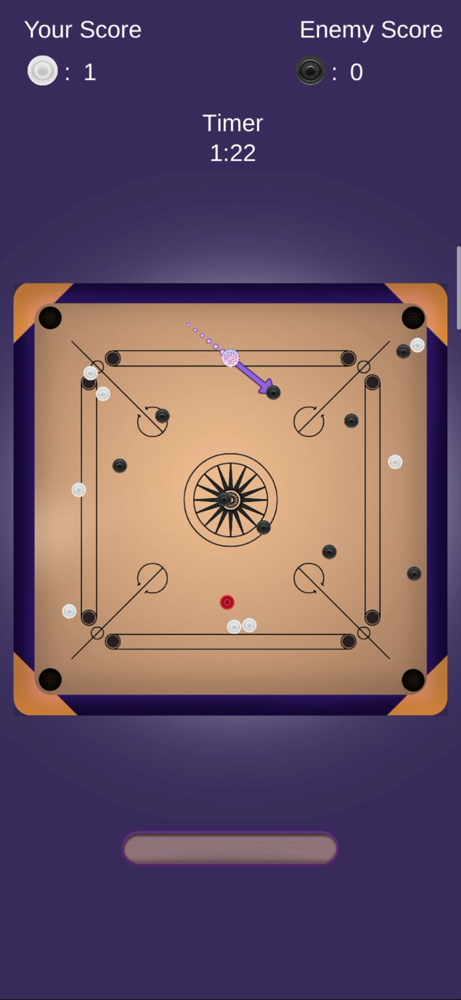
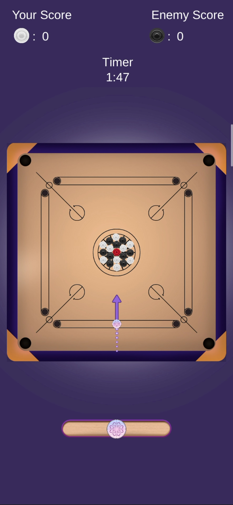
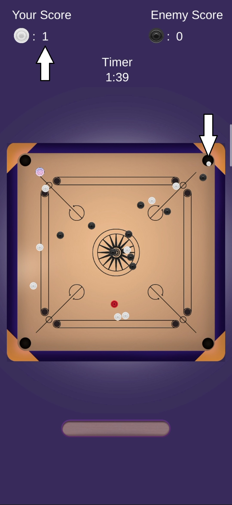
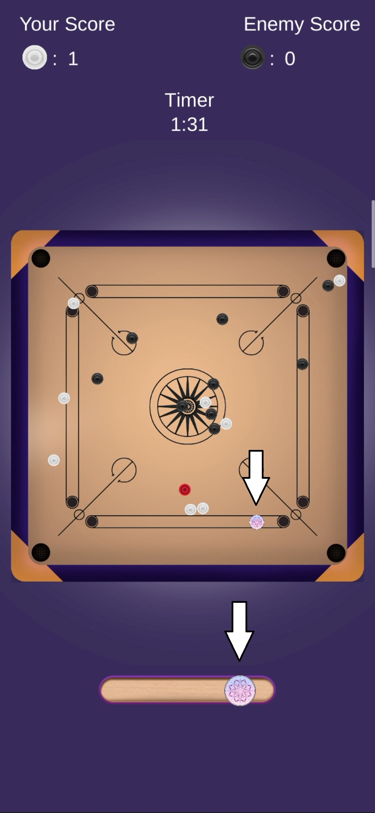

# Carrom Game

- Well organized hierarchy

  

- First Page (Home) with simple GUI

  

- Second Page (Game) satisfies the following:
  - AI enemy that can make simple shots (searches for the nearset puck)

    

  - Help Arrow with the direction of lunching the striker

    

  - Scoring system with banishing puck animation

    
    
  - Moving the striker with the bar 
  
    
    
    
  - In addition to:
    - 2 minutes timer.
    - Appropriate bouncing off the boundaries of the board for both the striker and pucks.
    - Checking for putting an appropriate puck to continue turn.
    - Checking for strikers fall in board pockets.
    - Well organized code for readability, and applied the needed OOP concepts in game scripts.

